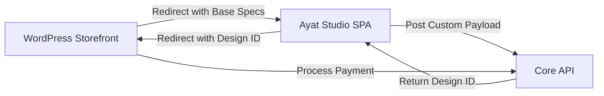

# AyatPrint Headless POC - WordPress Architecture

## Objective
Evaluate WordPress (WooCommerce) as the primary commerce layer handling marketing, CMS, and checkout, while delegating all artwork generation to the external Ayat Studio SPA.

## Workflow Overview
1. **Landing/Discovery:** Customer visits `https://ayatprint.com` (WordPress).
2. **Product Page:** Customer views "Surah Al-Ikhlas (Premium Canvas)".
3. **The Handoff:** Customer clicks **"Customize in Ayat Studio"**.
   - WordPress redirects to `https://studio.ayatprint.com/?productId=123&returnUrl=ayatprint.com/cart`
4. **Creation:** Customer uses Ayat Studio to select materials, frames, and AI colors.
5. **The Return:** Studio posts the payload to the Core API, gets a `CustomDesignID`.
   - Studio redirects back to WordPress: `https://ayatprint.com/cart/add?design_id=xyz789`
6. **Checkout:** WordPress adds the abstract custom item to the WooCommerce cart and processes payment.

## Architecture

## Evaluation
### Pros
- **SEO & CMS:** Unmatched content marketing capabilities out-of-the-box.
- **Speed to Market:** Huge ecosystem of plugins for payments, multi-language, and SEO.
- **Maintenance:** Relatively low cost and easy to find developers.

### Cons
- **Performance:** Can become sluggish without aggressive edge caching (Cloudflare).
- **Security:** Requires vigilant plugin updates and hardening.

### Estimated Migration Complexity
**Medium.** The primary challenge is building the WooCommerce custom cart item logic that accepts the `design_id` without knowing the complex attributes (which live in the Core API).
